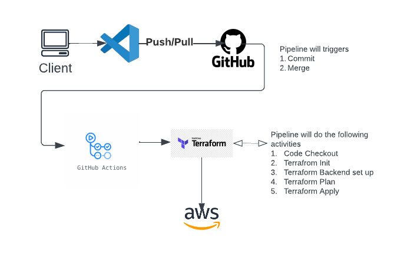

# AWS ECS Complete Infrastructure provisioning project

In this project we discuss how we can implement a complete AWS ECS environment with Terraform and GitHub actions pipeline to host container workloads.

## Technologies and Tools 
-  AWS as the Hosting Cloud provider
- Terraform as the Infrastructure as Code Tool
- GitHub for IaC code hosting and GitHub actions for CI/CD pipeline
- AWS CLI

### Prerequisites
##### 1. Manully generate a SSH Key Pair
##### 2. Active domain in Route53
##### 3. GitHub OIDC configuration between GitHub project and AWS 
## Infrastructure Resources and Highlevel connectivity

- AWS Network (VPC, Internet Gateway, Subnets, Route Tables, Nat Gateway, Security Groups)
- AWS EC2 Based ECS cluster (ECS Cluster, EC2 Compute, ECS Service, ECS Tasks, ECR)
- AWS Application Load Balancer and Target Group
- AWS EC2 Compute Auto scaling and ECS Container Auto scaling
- AWS RDS (Postgres Database server)
- AWS Secret Manager
- Route 53 and AWS Certificat eManager
- CloudWatch and SNS for Obervability and notifications

## GitHub Action pipeline

## Hi, I'm Sagara! 👋

## 🚀 About Me
I am an engineer with over 13 years of experience in the IT industry, working with various domains such as education, procurement, travel management, and corporate finance. I have multiple AWS certifications, a Kubernetes Certification, a HashiCorp Terraform certification and RedHat Certifications that demonstrate my proficiency and knowledge in Cloud engineering, DevOps engineering and Infrastructure automation.

Manual actions
* You have to push You have to push the docker image manully to the ECS Repository
* You can find a sample docker image in DockerHub
    Docker Hub URL : https://hub.docker.com/repository/docker/sgrsaga/project_repo_aws
* Download the docker image from docker hub
    # docker pull sgrsaga/project_repo_aws
* Tag the image to match for the ECR repo. In this case as below
    # docker tag sgrsaga/project_repo_aws:latest project_repo_aws:latest
* Then you can use the ECR push image commands to push the image to ECR Repository

